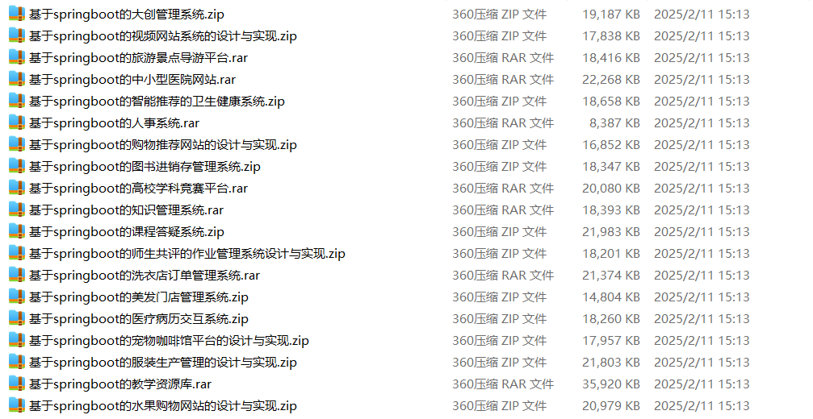

# springboot_anime_agriculture_flight

📦 SpringBoot多功能项目仓库 🎯

本仓库汇集了三个基于 **Spring Boot** 开发的高实用性项目，涵盖 **动漫管理、农业病害防治、航班运营管理** 等多个领域，适用于学习、开发实践和功能拓展！🚀

🎥 **国产动漫网站** —— 提供**动漫视频播放、资源分类、动漫推荐、用户互动、动漫收藏、弹幕评论、动漫资讯发布**等功能，打造优质的**动漫资源管理平台** 📺🎬

🍎 **果蔬作物疾病防治系统** —— 支持**病害识别、作物健康监测、病害防治方案、农业知识库、病害预警、农技专家在线咨询、农药使用指导**，助力**农业病害防治** 🌱✅

✈️ **航班进出港管理系统** —— 实现**航班进港管理、航班出港管理、登机口分配、航班时刻表、航班延误预警、旅客信息管理、行李托运跟踪**等功能，提升**机场航班管理效率** 📊🚀

**项目部署说明**✨：

推荐使用：**谷歌浏览器**

**后台地址**😎

http://localhost:8080/springboot/admin/dist/index.html

**前台地址**😎

http://localhost:8080/springboot547vl/front/index.html

在**src\main\resources\application.yml中**编辑数据库配置🎉										
url:jdbc:mysql://127.0.0.1:3306/springbootuseUnicode=true&characterEncoding=utf8&useJDBCCompliantTimezoneShift=true&useLegacyDatetimeCode=false&serverTimezone=UTC
username: root
password: 123456

**文档预览**👀

**其他项目合集**✨

